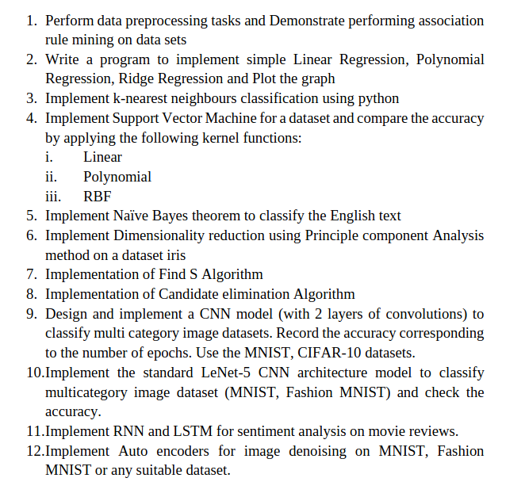

# ⚡ ml_lab – Applied Machine Learning Projects (Deployed)

✅ Complete Applied Machine Learning Lab Manual Solutions – Implemented in Python with clean code, sample outputs, visualizations, and interactive web apps for all major ML topics including Regression, Classification, Dimensionality Reduction, CNNs, RNNs, and more.

All models are trained **locally on CPU** and deployed using **Streamlit Cloud** for real-world usage and accessibility.

---

## 📋 Lab Task List Preview
  
*Click image to view full resolution*

---

---

## 🚀 Live Deployed Tasks

| Task | Title | Live App |
|------|-------|----------|
| 01 | 🛒 Association Rule Mining (Apriori) | [ml-task1-100rabh.streamlit.app](https://ml-task1-100rabh.streamlit.app) |
| 02 | 📈 Linear, Polynomial & Ridge Regression | [ml-task2-100rabh.streamlit.app](https://ml-task2-100rabh.streamlit.app) |
| 03 | 🔍 K-Nearest Neighbors Classifier | [ml-task3-100rabh.streamlit.app](https://ml-task3-100rabh.streamlit.app) |
| 04 | 🧠 SVM with Linear, Polynomial, and RBF Kernels | [ml-task4-100rabh.streamlit.app](https://ml-task4-100rabh.streamlit.app) |
| 05 | ✉️ Naive Bayes Text Classification (English) | [ml-task5-100rabh.streamlit.app](https://ml-task5-100rabh.streamlit.app) |
| 06 | 🔽 PCA on Iris Dataset | [ml-task6-100rabh.streamlit.app](https://ml-task6-100rabh.streamlit.app) |
| 07 | 🎯 Find-S Algorithm | [ml-task7-100rabh.streamlit.app](https://ml-task7-100rabh.streamlit.app) |
| 08 | 🧩 Candidate Elimination Algorithm | [ml-task8-100rabh.streamlit.app](https://ml-task8-100rabh.streamlit.app) |
| 09 | 🧠 Custom CNN on MNIST & CIFAR-10 | [ml-task9-100rabh.streamlit.app](https://ml-task9-100rabh.streamlit.app) |
| 10 | 🕹️ LeNet-5 on MNIST & Fashion MNIST | [ml-task10-100rabh.streamlit.app](https://ml-task10-100rabh.streamlit.app) |
| 11 | 🎬 RNN & LSTM for Sentiment Analysis | [ml-task11-100rabh.streamlit.app](https://ml-task11-100rabh.streamlit.app) |
| 12 | 🧼 Autoencoder for Image Denoising | [ml-task12-100rabh.streamlit.app](https://ml-task12-100rabh.streamlit.app) |

---

## 📁 Repository Structure

Each task has its own folder with:
- `app.py` / `notebook.ipynb`  
- `requirements.txt` (for deployment)   
- `README.md` with instructions

---

## 🧠 Tech Stack

- **Languages & Frameworks**: Python, Scikit-learn, TensorFlow, Keras, NLTK  
- **Frontend**: Streamlit  
- **Environment**: Conda, Arch Linux (Hyprland)  
- **Data**: Kaggle, MNIST, Fashion MNIST, IMDB Reviews  

---

## 👨‍🏫 Acknowledgment

Grateful to Prof. **Dr. Dhananjoy Bhakta** for mentoring the Applied Machine Learning Lab course.

---

## ✨ Coming Next

- Retrain DL models on GPU for performance boosts  
- Add leaderboard + visual reports  
- Deploy all tasks under a unified dashboard

---

## 🧑‍💻 Author

**Sourabh Sah**  
M.Tech CSE – Data Science & AI  
[GitHub](https://github.com/100rabhsah) • [LinkedIn](https://linkedin.com/in/sourabhsah)

---

